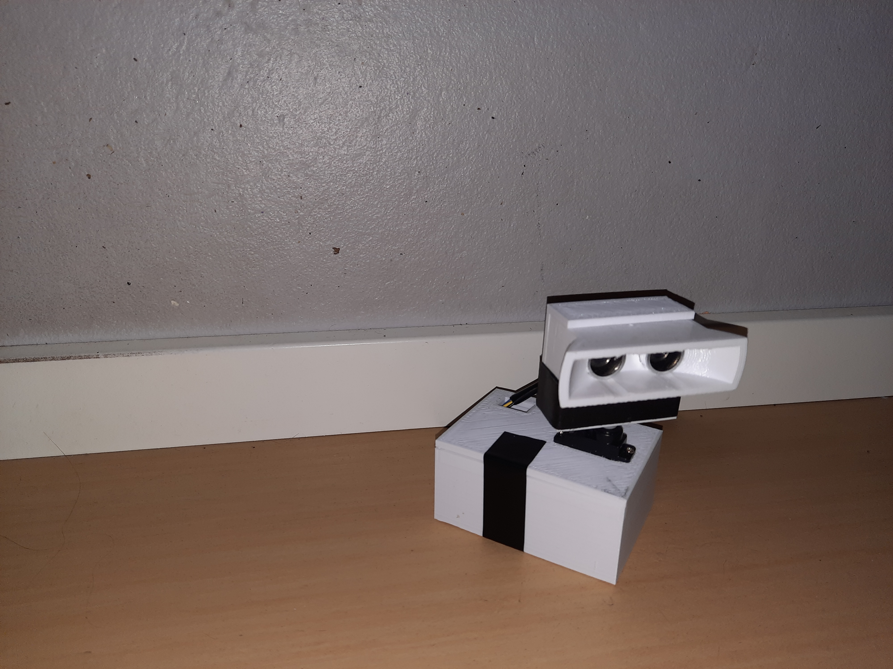

# Radar
This is a radar made with an Arduino, ultrasonic sensor and a servo motor. The ultrasonic sensor will be attached on the servo and register the length to an object for each degree the servo turns and draw it on the screen with [Processing 3](https://processing.org/download/). All the components are held together with a 3d printed chassi witch I taped together.

  

## How to Start
- radar v2 - src - main.cpp
  - This is the code you will run on the arduino ant this will make the radar work
- Draw_Radarv2 - Draw_radarv2.pde
  - This is the processing code to draw the radar interface
  
## Launch options
- In Draw_Radarv2 - Draw_radarv2.pde
  - Put your prefered usb-port here (The preset is COM5): `myPort = new Serial(this,"COM5", 9600);`
  - Change the total distance the radar registers, the shorter the better resulution on where the object is (The preset is 200cm): `if(dist<=200)`
- In radar v2 - src - main.cpp
  - Edit the pin number where you put the Trigger connection on your Arduino to your pin (The preset is pin 10): `const int trigPin=10;`
  - Edit the pin number where you put the Echo connection on your Arduino to your pin (The preset is pin 11): `const int echoPin=11;`
  - Edit the pin number where you put the Servo pin on your Arduino to your pin (The preset is pin 9): `servo.attach(9);`
  
  
  
### Software
- [Platform.io](https://platformio.org/install/ide?install=vscode)
  - Connects computer to the arduino and sends the code to the arduino from the computer
- [Processing 3](https://processing.org/download/)
  - Collects the data from the arduino (from the ultrasonic sensor and the servo) and projects it on the computer screen
#### Arduino librarys
- Arduino.h
  - Connects your computer to the arduino
- NewPing.h
  - Imports the data to the arduino to understand how the ultrasonic sensor works
- Servo.h
  - Imports the data to the arduino to understand how the servo works
  
### Parts used
- [Ultrasonic Sensor: HY-SRF05](https://www.electrokit.com/produkt/avstandsmatare-ultraljud-hy-srf05-2-450cm/) 
- [Servo: SM-S2309S](https://www.amazon.com/SpingRC-SM-S2309S-Micro-analog-plastic/dp/B01CV7CPL6)
- [Arduino: UNO R3](https://www.electrokit.com/produkt/arduino-uno-mega328-rev-3/)
